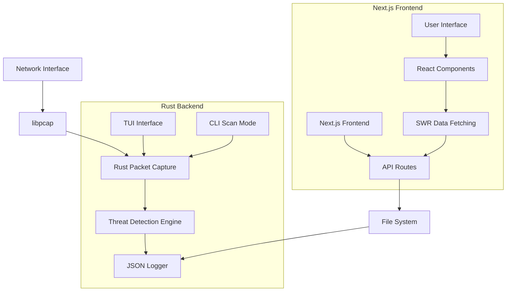
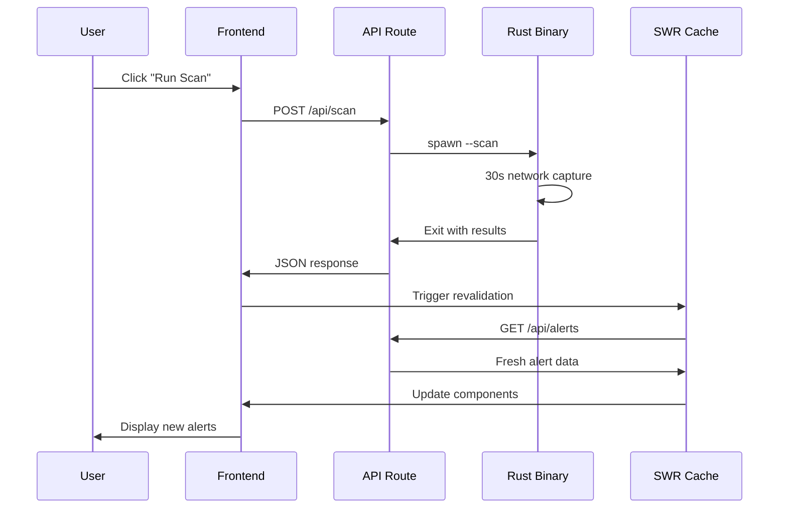

# 📚 CyberSentinel Codebase Documentation

> **Comprehensive technical documentation for developers, contributors, and security professionals**

---

## 🎯 Purpose

This document provides an in-depth technical analysis of the CyberSentinel codebase, designed to help developers understand the architecture, contribute effectively, and extend the system's capabilities.

## 📋 Table of Contents

1. [Architecture Overview](#-architecture-overview)
2. [Backend Deep Dive](#-backend-deep-dive-rust)
3. [Frontend Architecture](#-frontend-architecture-nextjs)
4. [Data Flow](#-data-flow)
5. [Security Implementation](#-security-implementation)
6. [Performance Optimization](#-performance-optimization)
7. [Testing Strategy](#-testing-strategy)
8. [Deployment Guide](#-deployment-guide)
9. [Troubleshooting](#-troubleshooting)
10. [Best Practices](#-best-practices)

---

## 🏗️ Architecture Overview

### **System Design Philosophy**

CyberSentinel follows a **hybrid architecture** pattern that combines:

- **High-Performance Backend**: Rust for system-level operations
- **Modern Frontend**: Next.js for user experience
- **Real-Time Communication**: JSON-based API with SWR for live updates
- **Modular Design**: Separation of concerns across components

### **Component Interaction Diagram**



### **Technology Stack Breakdown**

| Component | Technology | Version | Purpose | Key Features |
|-----------|------------|---------|---------|--------------|
| **Packet Capture** | libpcap | 1.10+ | Raw packet capture | Zero-copy, kernel bypass |
| **Backend Language** | Rust | 1.70+ | Systems programming | Memory safety, performance |
| **Network Processing** | pcap crate | 1.1 | Rust bindings for libpcap | Type-safe packet handling |
| **Serialization** | serde/serde_json | 1.0 | Data serialization | Zero-copy deserialization |
| **Time Handling** | chrono | 0.4 | Timestamp management | RFC3339 formatting |
| **TUI Framework** | ratatui | 0.26 | Terminal interface | Event-driven UI |
| **Terminal Backend** | crossterm | 0.27 | Cross-platform terminal | Raw mode, events |
| **Frontend Framework** | Next.js | 14.0 | React framework | App Router, SSR |
| **UI Language** | TypeScript | 5.0+ | Type safety | Strict mode enabled |
| **Component Library** | shadcn/ui | Latest | Accessible components | Radix primitives |
| **Styling** | Tailwind CSS | 3.0 | Utility-first CSS | JIT compilation |
| **Data Fetching** | SWR | 2.2 | Client-side data sync | Real-time updates |
| **Charts** | Recharts | 2.8 | Data visualization | SVG-based rendering |

---

## 🦀 Backend Deep Dive (Rust)

### **Core Modules**

#### **1. main.rs** - Application Entry Point

```rust
// Dual-mode application: TUI dashboard or CLI scan
fn main() {
    let args: Vec<String> = env::args().collect();
    
    if args.len() > 1 && args[1] == "--scan" {
        run_scan_mode(); // 30-second network scan
    } else {
        run_tui_mode();  // Interactive dashboard
    }
}
```

**Key Features:**
- Command-line argument parsing
- Mode selection (TUI vs Scan)
- Graceful error handling
- Signal handling for cleanup

#### **2. monitor.rs** - Network Packet Capture

```rust
use pcap::{Capture, Device};
use std::sync::Arc;
use parking_lot::Mutex;

pub fn start_capture(stats: Arc<Mutex<NetworkStats>>) -> Result<(), Box<dyn Error>> {
    let device = Device::lookup()?
        .ok_or("No network device found")?;
    
    let mut cap = Capture::from_device(device)?
        .promisc(true)      // Promiscuous mode
        .snaplen(65535)     // Full packet capture
        .timeout(1000)      // 1 second timeout
        .open()?;
    
    // Apply BPF filter for relevant traffic
    cap.filter("tcp or udp", true)?;
    
    while let Ok(packet) = cap.next_packet() {
        process_packet(&packet, &stats)?;
    }
    
    Ok(())
}
```

**Implementation Details:**
- **Promiscuous Mode**: Captures all network traffic on the interface
- **BPF Filtering**: Kernel-level packet filtering for performance
- **Error Recovery**: Continues operation despite individual packet errors
- **Thread Safety**: Uses `Arc<Mutex<T>>` for shared state

#### **3. detector.rs** - Threat Detection Engine

```rust
pub struct ThreatDetector {
    patterns: Vec<ThreatPattern>,
    connection_tracker: HashMap<IpAddr, ConnectionInfo>,
    rate_limiter: RateLimiter,
}

impl ThreatDetector {
    pub fn analyze_packet(&mut self, packet: &PacketInfo) -> Vec<Alert> {
        let mut alerts = Vec::new();
        
        // Port scan detection
        if self.detect_port_scan(&packet.source_ip, packet.dest_port) {
            alerts.push(Alert::new("Port scan detected", Severity::High));
        }
        
        // Suspicious protocols
        if self.is_suspicious_protocol(&packet.protocol, packet.dest_port) {
            alerts.push(Alert::new("Suspicious protocol usage", Severity::Medium));
        }
        
        // Rate limiting violations
        if self.rate_limiter.check_violation(&packet.source_ip) {
            alerts.push(Alert::new("Rate limit exceeded", Severity::Low));
        }
        
        alerts
    }
}
```

**Detection Algorithms:**
- **Port Scan Detection**: Tracks connection attempts per IP
- **Protocol Analysis**: Identifies unusual protocol/port combinations
- **Rate Limiting**: Detects high-frequency requests
- **Behavioral Analysis**: Statistical anomaly detection

#### **4. logger.rs** - JSON Logging System

```rust
#[derive(Serialize, Deserialize)]
pub struct LogEntry {
    timestamp: String,      // RFC3339 format
    source_ip: String,      // IPv4/IPv6 address
    dest_ip: String,
    source_port: u16,
    dest_port: u16,
    protocol: String,       // TCP, UDP, ICMP, etc.
    alert: String,          // Human-readable alert message
}

pub fn finalize_alerts_json() {
    // Convert line-delimited JSON to JSON array
    let entries: Vec<LogEntry> = read_log_entries()?;
    let json_array = serde_json::to_string_pretty(&entries)?;
    write_file("alerts.json", &json_array)?;
}
```

**Data Format:**
- **Structured Logging**: Consistent JSON schema
- **Timestamp Precision**: Microsecond accuracy
- **Format Conversion**: Line-delimited to array format
- **Error Handling**: Graceful degradation on write failures

#### **5. state.rs** - Shared Application State

```rust
#[derive(Debug, Clone)]
pub struct NetworkStats {
    pub total_packets: u64,
    pub tcp_packets: u64,
    pub udp_packets: u64,
    pub start_time: Instant,
    pub active_connections: HashSet<Connection>,
}

pub fn create_shared_state() -> Arc<Mutex<NetworkStats>> {
    Arc::new(Mutex::new(NetworkStats::default()))
}
```

**State Management:**
- **Thread-Safe**: `Arc<Mutex<T>>` for concurrent access
- **Atomic Updates**: Lock-free counters where possible
- **Memory Efficient**: Minimal allocations in hot paths
- **Real-Time**: Live statistics calculation

#### **6. ui.rs** - Terminal User Interface

```rust
use ratatui::{
    backend::CrosstermBackend,
    layout::{Constraint, Direction, Layout},
    widgets::{Block, Borders, Chart, Dataset, Gauge, List, ListItem},
    Terminal,
};

pub fn run_dashboard(stats: Arc<Mutex<NetworkStats>>) -> Result<(), Box<dyn Error>> {
    enable_raw_mode()?;
    let mut stdout = io::stdout();
    execute!(stdout, EnterAlternateScreen, EnableMouseCapture)?;
    
    let backend = CrosstermBackend::new(stdout);
    let mut terminal = Terminal::new(backend)?;
    
    loop {
        terminal.draw(|f| {
            render_dashboard(f, &stats);
        })?;
        
        if handle_events()? {
            break;
        }
    }
    
    cleanup_terminal()?;
    Ok(())
}
```

**UI Features:**
- **Real-Time Updates**: 60 FPS refresh rate
- **Interactive Controls**: Keyboard navigation
- **Multiple Views**: Statistics, alerts, configuration
- **Responsive Layout**: Adapts to terminal size

### **Performance Optimizations**

#### **Memory Management**
```rust
// Zero-copy packet processing
fn process_packet_zero_copy(packet: &[u8]) -> PacketInfo {
    PacketInfo {
        timestamp: Instant::now(),
        data: PacketData::from_slice(packet), // No allocation
        ..Default::default()
    }
}

// Object pooling for frequent allocations
lazy_static! {
    static ref PACKET_POOL: ObjectPool<PacketInfo> = ObjectPool::new(1000);
}
```

#### **Concurrent Processing**
```rust
// Multi-threaded packet processing
let (tx, rx) = mpsc::channel();

// Capture thread
thread::spawn(move || {
    while let Ok(packet) = capture.next_packet() {
        tx.send(packet).unwrap();
    }
});

// Processing threads
for _ in 0..num_cpus::get() {
    let rx = rx.clone();
    thread::spawn(move || {
        while let Ok(packet) = rx.recv() {
            process_packet(packet);
        }
    });
}
```

---

## ⚛️ Frontend Architecture (Next.js)

### **App Router Structure**

```
src/Client/app/
├── layout.tsx              # Root layout with providers
├── page.tsx                # Main dashboard page
├── globals.css             # Global styles and CSS variables
└── api/                    # API routes
    ├── alerts/
    │   └── route.ts        # GET /api/alerts
    └── scan/
        └── route.ts        # POST /api/scan
```

### **Component Architecture**

#### **1. Main Dashboard (page.tsx)**

```typescript
'use client'

export default function Dashboard() {
  const { data: alerts, mutate } = useSWR('/api/alerts', fetcher, {
    refreshInterval: 5000, // 5-second refresh
    revalidateOnFocus: true
  });
  
  const [isScanning, setIsScanning] = useState(false);
  const [searchTerm, setSearchTerm] = useState('');
  
  const handleScan = async () => {
    setIsScanning(true);
    try {
      await fetch('/api/scan', { method: 'POST' });
      await mutate(); // Revalidate data
      toast.success('Scan completed successfully');
    } catch (error) {
      toast.error('Scan failed');
    } finally {
      setIsScanning(false);
    }
  };
  
  return (
    <div className="min-h-screen bg-background">
      <DashboardHeader onScan={handleScan} isScanning={isScanning} />
      <StatsGrid alerts={alerts} />
      <Tabs defaultValue="overview">
        <TabsList>
          <TabsTrigger value="overview">Overview</TabsTrigger>
          <TabsTrigger value="alerts">Live Alerts</TabsTrigger>
          <TabsTrigger value="analytics">Analytics</TabsTrigger>
        </TabsList>
        
        <TabsContent value="overview">
          <div className="grid grid-cols-1 lg:grid-cols-2 gap-6">
            <PacketChart alerts={alerts} />
            <TopIpsTable alerts={alerts} />
          </div>
        </TabsContent>
        
        <TabsContent value="alerts">
          <AlertFeed alerts={alerts} searchTerm={searchTerm} />
        </TabsContent>
      </Tabs>
    </div>
  );
}
```

**Key Features:**
- **Real-Time Updates**: SWR with 5-second refresh interval
- **State Management**: React hooks for UI state
- **Error Handling**: Toast notifications for user feedback
- **Responsive Design**: Grid layout adapts to screen size

#### **2. Component Library**

**StatsGrid.tsx** - Key Metrics Display
```typescript
interface StatsGridProps {
  alerts: Alert[];
}

export function StatsGrid({ alerts }: StatsGridProps) {
  const stats = useMemo(() => ({
    total: alerts.length,
    tcp: alerts.filter(a => a.protocol === 'TCP').length,
    udp: alerts.filter(a => a.protocol === 'UDP').length,
    high: alerts.filter(a => a.severity === 'high').length
  }), [alerts]);
  
  return (
    <div className="grid grid-cols-1 md:grid-cols-2 lg:grid-cols-4 gap-4">
      <StatCard
        title="Total Packets"
        value={stats.total}
        change="+12.5%"
        icon={Activity}
      />
      {/* More stat cards... */}
    </div>
  );
}
```

**AlertFeed.tsx** - Real-Time Alert Display
```typescript
export function AlertFeed({ alerts, searchTerm }: AlertFeedProps) {
  const filteredAlerts = useMemo(() => {
    return alerts.filter(alert =>
      alert.source_ip.includes(searchTerm) ||
      alert.alert.toLowerCase().includes(searchTerm.toLowerCase())
    );
  }, [alerts, searchTerm]);
  
  return (
    <Card>
      <CardHeader>
        <CardTitle>Live Security Alerts</CardTitle>
      </CardHeader>
      <CardContent>
        <ScrollArea className="h-[600px]">
          <div className="space-y-2">
            {filteredAlerts.map((alert, index) => (
              <AlertItem key={index} alert={alert} />
            ))}
          </div>
        </ScrollArea>
      </CardContent>
    </Card>
  );
}
```

**PacketChart.tsx** - Data Visualization
```typescript
export function PacketChart({ alerts }: PacketChartProps) {
  const chartData = useMemo(() => {
    // Group alerts by hour for 24h view
    const hourlyData = groupAlertsByHour(alerts);
    return formatChartData(hourlyData);
  }, [alerts]);
  
  return (
    <Card>
      <CardHeader>
        <CardTitle>Packet Activity (24h)</CardTitle>
      </CardHeader>
      <CardContent>
        <ResponsiveContainer width="100%" height={300}>
          <LineChart data={chartData}>
            <CartesianGrid strokeDasharray="3 3" />
            <XAxis dataKey="time" />
            <YAxis />
            <Tooltip />
            <Line
              type="monotone"
              dataKey="packets"
              stroke="#8884d8"
              strokeWidth={2}
            />
          </LineChart>
        </ResponsiveContainer>
      </CardContent>
    </Card>
  );
}
```

### **API Routes Implementation**

#### **alerts/route.ts** - Alert Data Endpoint
```typescript
import { NextResponse } from 'next/server';
import { readFileSync, existsSync } from 'fs';
import { join } from 'path';

export async function GET() {
  try {
    const alertsPath = join(process.cwd(), 'public', 'alerts.json');
    
    if (!existsSync(alertsPath)) {
      return NextResponse.json([]);
    }
    
    const alertsData = readFileSync(alertsPath, 'utf8');
    const alerts = JSON.parse(alertsData);
    
    // Sort by timestamp (newest first)
    alerts.sort((a, b) => new Date(b.timestamp).getTime() - new Date(a.timestamp).getTime());
    
    return NextResponse.json(alerts);
  } catch (error) {
    console.error('Error reading alerts:', error);
    return NextResponse.json({ error: 'Failed to read alerts' }, { status: 500 });
  }
}
```

#### **scan/route.ts** - Scan Trigger Endpoint
```typescript
import { spawn } from 'child_process';
import { NextResponse } from 'next/server';

export async function POST() {
  try {
    const rustBinaryPath = join(process.cwd(), '..', '..', 'target', 'debug', 'cybersentinel');
    
    if (!existsSync(rustBinaryPath)) {
      return NextResponse.json({
        success: false,
        error: 'CyberSentinel binary not found. Please build the project first with: cargo build'
      }, { status: 500 });
    }
    
    // Clear previous alerts
    writeFileSync(alertsPath, '[]');
    
    return new Promise((resolve) => {
      const child = spawn(rustBinaryPath, ['--scan'], {
        timeout: 35000, // 35 second timeout
        cwd: join(process.cwd(), 'public'),
      });
      
      let stdout = '';
      child.stdout?.on('data', (data) => stdout += data.toString());
      
      child.on('close', (code) => {
        if (code === 0) {
          const updatedAlerts = JSON.parse(readFileSync(alertsPath, 'utf8'));
          resolve(NextResponse.json({
            success: true,
            message: 'Scan completed successfully',
            alertsCount: updatedAlerts.length,
            alerts: updatedAlerts,
            output: stdout
          }));
        } else {
          resolve(NextResponse.json({
            success: false,
            error: `Scan failed with exit code ${code}`
          }, { status: 500 }));
        }
      });
    });
  } catch (error) {
    return NextResponse.json({
      success: false,
      error: 'Internal server error'
    }, { status: 500 });
  }
}
```

### **State Management & Data Flow**

#### **SWR Configuration**
```typescript
// lib/swr-config.ts
export const swrConfig = {
  refreshInterval: 5000,           // 5-second refresh
  revalidateOnFocus: true,         // Refresh on window focus
  revalidateOnReconnect: true,     // Refresh on network reconnect
  dedupingInterval: 2000,          // Prevent duplicate requests
  errorRetryCount: 3,              // Retry failed requests
  errorRetryInterval: 1000,        // Wait 1s between retries
  fetcher: (url: string) => fetch(url).then(res => res.json())
};
```

#### **Custom Hooks**
```typescript
// hooks/useAlerts.ts
export function useAlerts() {
  const { data, error, mutate } = useSWR('/api/alerts', fetcher, swrConfig);
  
  return {
    alerts: data || [],
    isLoading: !error && !data,
    isError: error,
    refresh: mutate
  };
}

// hooks/useScan.ts
export function useScan() {
  const [isScanning, setIsScanning] = useState(false);
  const { refresh } = useAlerts();
  
  const startScan = async () => {
    setIsScanning(true);
    try {
      const response = await fetch('/api/scan', { method: 'POST' });
      const result = await response.json();
      
      if (result.success) {
        await refresh(); // Refresh alerts data
        toast.success(`Scan completed: ${result.alertsCount} alerts found`);
      } else {
        toast.error(result.error);
      }
    } catch (error) {
      toast.error('Scan failed to start');
    } finally {
      setIsScanning(false);
    }
  };
  
  return { startScan, isScanning };
}
```

---

## 🔄 Data Flow

### **Complete Request Lifecycle**

1. **User Initiates Scan**
   ```
   User clicks "Run Scan" → React onClick handler → useScan hook
   ```

2. **Frontend API Call**
   ```
   fetch('/api/scan', { method: 'POST' }) → Next.js API route
   ```

3. **Backend Process Spawn**
   ```
   spawn(rustBinaryPath, ['--scan']) → Rust binary execution
   ```

4. **Network Monitoring**
   ```
   libpcap capture → Packet analysis → Threat detection → JSON logging
   ```

5. **Data Persistence**
   ```
   alerts.json file update → File system write
   ```

6. **Frontend Data Refresh**
   ```
   SWR revalidation → GET /api/alerts → React state update
   ```

7. **UI Updates**
   ```
   Component re-render → Real-time dashboard updates
   ```

### **Real-Time Data Synchronization**



---

## 🔒 Security Implementation

### **Network Security**

#### **Privilege Management**
```bash
# Grant minimal required capabilities
sudo setcap cap_net_raw,cap_net_admin=eip target/release/cybersentinel

# Verify capabilities
getcap target/release/cybersentinel
# Output: target/release/cybersentinel = cap_net_admin,cap_net_raw+eip
```

#### **Packet Capture Security**
```rust
// Secure packet capture configuration
let mut capture = Capture::from_device(device)?
    .promisc(true)              // Required for network monitoring
    .snaplen(65535)             // Full packet capture
    .buffer_size(1_000_000)     // 1MB buffer to prevent drops
    .timeout(1000)              // 1s timeout to prevent blocking
    .open()?;

// Apply restrictive BPF filter
capture.filter("tcp or udp and not host 127.0.0.1", true)?;
```

### **Application Security**

#### **Input Validation**
```typescript
// API input sanitization
function sanitizeInput(input: string): string {
  return input
    .replace(/[<>'"]/g, '') // Remove HTML/script chars
    .substring(0, 100)      // Limit length
    .trim();                // Remove whitespace
}

// IP address validation
function isValidIP(ip: string): boolean {
  const ipv4Regex = /^(\d{1,3}\.){3}\d{1,3}$/;
  const ipv6Regex = /^([0-9a-fA-F]{1,4}:){7}[0-9a-fA-F]{1,4}$/;
  return ipv4Regex.test(ip) || ipv6Regex.test(ip);
}
```

#### **Process Isolation**
```rust
// Rust binary runs in isolated process
use std::process::{Command, Stdio};

let output = Command::new("./cybersentinel")
    .arg("--scan")
    .stdin(Stdio::null())      // No stdin access
    .stdout(Stdio::piped())    // Capture output
    .stderr(Stdio::piped())    // Capture errors
    .spawn()?;
```

### **Data Protection**

#### **File System Security**
```typescript
// Secure file operations
const alertsPath = join(process.cwd(), 'public', 'alerts.json');

// Validate file path to prevent directory traversal
if (!alertsPath.startsWith(process.cwd())) {
  throw new Error('Invalid file path');
}

// Read with error handling
try {
  const data = readFileSync(alertsPath, 'utf8');
  const parsed = JSON.parse(data);
  return parsed;
} catch (error) {
  return []; // Fail securely
}
```

---

## ⚡ Performance Optimization

### **Backend Performance**

#### **Memory Optimization**
```rust
// Use stack allocation for small data
const MAX_PACKET_SIZE: usize = 1500;
let mut buffer: [u8; MAX_PACKET_SIZE] = [0; MAX_PACKET_SIZE];

// Avoid unnecessary allocations
fn process_packet_efficient(packet: &[u8]) -> Option<Alert> {
    // Work directly with slice, no allocation
    if packet.len() < 20 { return None; }
    
    let source_ip = u32::from_be_bytes([
        packet[12], packet[13], packet[14], packet[15]
    ]);
    
    // ... process without creating intermediate strings
}
```

#### **Lock-Free Operations**
```rust
use std::sync::atomic::{AtomicU64, Ordering};

#[derive(Default)]
pub struct FastStats {
    tcp_count: AtomicU64,
    udp_count: AtomicU64,
    total_bytes: AtomicU64,
}

impl FastStats {
    pub fn increment_tcp(&self) {
        self.tcp_count.fetch_add(1, Ordering::Relaxed);
    }
    
    pub fn get_tcp_count(&self) -> u64 {
        self.tcp_count.load(Ordering::Relaxed)
    }
}
```

### **Frontend Performance**

#### **React Optimization**
```typescript
// Memoized calculations
const statsData = useMemo(() => {
  return {
    total: alerts.length,
    tcp: alerts.filter(a => a.protocol === 'TCP').length,
    udp: alerts.filter(a => a.protocol === 'UDP').length,
    high: alerts.filter(a => getSeverityLevel(a.alert) === 'high').length
  };
}, [alerts]);

// Virtualized lists for large datasets
import { FixedSizeList as List } from 'react-window';

const AlertList = ({ alerts }) => (
  <List
    height={600}
    itemCount={alerts.length}
    itemSize={60}
    itemData={alerts}
  >
    {AlertRow}
  </List>
);
```

#### **Network Optimization**
```typescript
// Efficient data fetching
const { data: alerts } = useSWR('/api/alerts', fetcher, {
  refreshInterval: 5000,
  dedupingInterval: 2000,    // Prevent duplicate requests
  revalidateIfStale: false,  // Don't fetch stale data
  revalidateOnMount: true,   // Fresh data on component mount
});

// Request compression
const fetcher = async (url: string) => {
  const response = await fetch(url, {
    headers: {
      'Accept-Encoding': 'gzip, deflate, br'
    }
  });
  return response.json();
};
```

### **Build Optimization**

#### **Rust Release Build**
```toml
# Cargo.toml
[profile.release]
opt-level = 3              # Maximum optimization
lto = true                 # Link-time optimization
codegen-units = 1          # Single codegen unit
panic = "abort"            # Smaller binary size
strip = true               # Strip debug symbols
```

#### **Next.js Production Build**
```javascript
// next.config.js
module.exports = {
  experimental: {
    optimizeCss: true,
    optimizeServerReact: true,
  },
  compiler: {
    removeConsole: process.env.NODE_ENV === 'production',
  },
  images: {
    unoptimized: true,
  },
};
```

---

## 🧪 Testing Strategy

### **Rust Testing**

#### **Unit Tests**
```rust
#[cfg(test)]
mod tests {
    use super::*;
    
    #[test]
    fn test_port_scan_detection() {
        let mut detector = ThreatDetector::new();
        let source_ip = "192.168.1.100".parse().unwrap();
        
        // Simulate port scan
        for port in 80..90 {
            let packet = PacketInfo {
                source_ip,
                dest_port: port,
                protocol: "TCP".to_string(),
                ..Default::default()
            };
            
            detector.analyze_packet(&packet);
        }
        
        assert!(detector.is_port_scan_detected(&source_ip));
    }
    
    #[test]
    fn test_json_serialization() {
        let alert = LogEntry {
            timestamp: "2025-08-07T10:30:15.123Z".to_string(),
            source_ip: "192.168.1.100".to_string(),
            dest_ip: "10.0.0.1".to_string(),
            source_port: 443,
            dest_port: 80,
            protocol: "TCP".to_string(),
            alert: "Test alert".to_string(),
        };
        
        let json = serde_json::to_string(&alert).unwrap();
        let deserialized: LogEntry = serde_json::from_str(&json).unwrap();
        
        assert_eq!(alert.source_ip, deserialized.source_ip);
    }
}
```

#### **Integration Tests**
```rust
#[test]
fn test_capture_and_detect() {
    let stats = create_shared_state();
    
    // Start capture in background
    let stats_clone = stats.clone();
    let handle = thread::spawn(move || {
        start_capture(stats_clone).unwrap();
    });
    
    // Generate test traffic
    generate_test_packets();
    
    // Wait for processing
    thread::sleep(Duration::from_secs(2));
    
    // Verify detection
    let stats_guard = stats.lock();
    assert!(stats_guard.total_packets > 0);
}
```

### **Frontend Testing**

#### **Component Tests**
```typescript
// __tests__/StatsGrid.test.tsx
import { render, screen } from '@testing-library/react';
import { StatsGrid } from '../components/StatsGrid';

const mockAlerts = [
  {
    source_ip: '192.168.1.100',
    protocol: 'TCP',
    alert: 'Test alert',
    timestamp: '2025-08-07T10:30:15.123Z'
  }
];

test('displays correct statistics', () => {
  render(<StatsGrid alerts={mockAlerts} />);
  
  expect(screen.getByText('1')).toBeInTheDocument(); // Total packets
  expect(screen.getByText('TCP')).toBeInTheDocument(); // Protocol
});
```

#### **API Tests**
```typescript
// __tests__/api.test.ts
import { GET } from '../app/api/alerts/route';
import { NextRequest } from 'next/server';

test('alerts endpoint returns JSON', async () => {
  const request = new NextRequest('http://localhost:3000/api/alerts');
  const response = await GET(request);
  
  expect(response.status).toBe(200);
  
  const data = await response.json();
  expect(Array.isArray(data)).toBe(true);
});
```

### **Performance Tests**

#### **Load Testing**
```rust
#[bench]
fn bench_packet_processing(b: &mut Bencher) {
    let packet = create_test_packet();
    
    b.iter(|| {
        black_box(process_packet(&packet));
    });
}
```

#### **Memory Profiling**
```bash
# Run with memory profiling
cargo run --release --features=profiling

# Analyze memory usage
valgrind --tool=massif target/release/cybersentinel --scan
```

---

## 🚀 Deployment Guide

### **Production Build**

#### **Rust Binary**
```bash
# Optimized release build
cargo build --release

# Cross-compilation for different targets
cargo build --release --target x86_64-unknown-linux-musl
cargo build --release --target aarch64-apple-darwin
```

#### **Frontend Build**
```bash
cd src/Client

# Production build
npm run build

# Static export (optional)
npm run export
```

### **Docker Deployment**

#### **Multi-stage Dockerfile**
```dockerfile
# Stage 1: Rust build
FROM rust:1.70-alpine AS rust-builder

WORKDIR /app
COPY Cargo.toml Cargo.lock ./
COPY src/ ./src/

RUN apk add --no-cache musl-dev libpcap-dev
RUN cargo build --release

# Stage 2: Node.js build
FROM node:18-alpine AS node-builder

WORKDIR /app
COPY src/Client/package*.json ./
RUN npm ci --only=production

COPY src/Client/ ./
RUN npm run build

# Stage 3: Production image
FROM alpine:latest

RUN apk add --no-cache libpcap nodejs npm

WORKDIR /app

# Copy Rust binary
COPY --from=rust-builder /app/target/release/cybersentinel ./
RUN chmod +x cybersentinel

# Copy Node.js app
COPY --from=node-builder /app/.next ./.next
COPY --from=node-builder /app/node_modules ./node_modules
COPY --from=node-builder /app/package.json ./

# Set capabilities
RUN setcap cap_net_raw,cap_net_admin=eip cybersentinel

EXPOSE 3000

CMD ["npm", "start"]
```

### **Systemd Service**

```ini
# /etc/systemd/system/cybersentinel.service
[Unit]
Description=CyberSentinel Network Security Monitor
After=network.target

[Service]
Type=forking
User=cybersentinel
Group=cybersentinel
WorkingDirectory=/opt/cybersentinel
ExecStart=/opt/cybersentinel/start.sh
ExecReload=/bin/kill -HUP $MAINPID
Restart=always
RestartSec=10

# Security settings
NoNewPrivileges=true
PrivateTmp=true
ProtectSystem=strict
ProtectHome=true
ReadWritePaths=/opt/cybersentinel/data

# Network capabilities
AmbientCapabilities=CAP_NET_RAW CAP_NET_ADMIN

[Install]
WantedBy=multi-user.target
```

### **Monitoring & Logging**

#### **Application Metrics**
```rust
// metrics.rs
use prometheus::{Counter, Histogram, Gauge};

lazy_static! {
    static ref PACKETS_PROCESSED: Counter = Counter::new(
        "packets_processed_total", 
        "Total number of packets processed"
    ).unwrap();
    
    static ref PROCESSING_TIME: Histogram = Histogram::new(
        "packet_processing_seconds",
        "Time spent processing packets"
    ).unwrap();
    
    static ref ACTIVE_CONNECTIONS: Gauge = Gauge::new(
        "active_connections",
        "Number of active network connections"
    ).unwrap();
}
```

#### **Log Configuration**
```rust
// Initialize structured logging
use tracing::{info, warn, error};
use tracing_subscriber::{layer::SubscriberExt, util::SubscriberInitExt};

fn init_logging() {
    tracing_subscriber::registry()
        .with(tracing_subscriber::EnvFilter::new(
            std::env::var("RUST_LOG").unwrap_or_else(|_| "info".into()),
        ))
        .with(tracing_subscriber::fmt::layer())
        .init();
}
```

---

## 🔧 Troubleshooting

### **Common Issues**

#### **Permission Errors**
```bash
# Error: Operation not permitted
# Solution: Grant network capabilities
sudo setcap cap_net_raw,cap_net_admin=eip target/release/cybersentinel

# Verify capabilities
getcap target/release/cybersentinel
```

#### **Build Failures**
```bash
# libpcap not found
# Ubuntu/Debian:
sudo apt-get install libpcap-dev

# macOS:
brew install libpcap

# Fedora/RHEL:
sudo dnf install libpcap-devel
```

#### **Port Already in Use**
```bash
# Check what's using port 3000
lsof -i :3000

# Kill the process
kill -9 <PID>

# Use different port
PORT=3001 npm run dev
```

### **Performance Issues**

#### **High Memory Usage**
```rust
// Monitor memory allocation
use jemalloc_ctl::{stats, epoch};

fn print_memory_stats() {
    epoch::advance().unwrap();
    let allocated = stats::allocated::read().unwrap();
    let resident = stats::resident::read().unwrap();
    
    println!("Memory allocated: {} bytes", allocated);
    println!("Memory resident: {} bytes", resident);
}
```

#### **Packet Drops**
```rust
// Increase buffer sizes
let mut capture = Capture::from_device(device)?
    .buffer_size(10_000_000)  // 10MB buffer
    .immediate_mode(true)     // Process immediately
    .open()?;
```

### **Debugging Tools**

#### **Rust Debugging**
```bash
# Debug build with symbols
cargo build

# Run with GDB
gdb target/debug/cybersentinel

# Backtrace on panic
RUST_BACKTRACE=1 ./target/debug/cybersentinel
RUST_BACKTRACE=full ./target/debug/cybersentinel
```

#### **Network Debugging**
```bash
# Test packet capture
sudo tcpdump -i any -c 10

# Check network interfaces
ip link show

# Monitor network statistics
ss -tuln
```

---

## 📚 Best Practices

### **Code Quality**

#### **Rust Guidelines**
```rust
// Use explicit error types
#[derive(Debug, thiserror::Error)]
pub enum CaptureError {
    #[error("Device not found: {device}")]
    DeviceNotFound { device: String },
    
    #[error("Permission denied: {0}")]
    PermissionDenied(String),
    
    #[error("IO error: {0}")]
    Io(#[from] std::io::Error),
}

// Implement Display for custom types
impl fmt::Display for PacketInfo {
    fn fmt(&self, f: &mut fmt::Formatter<'_>) -> fmt::Result {
        write!(f, "{}:{} -> {}:{} ({})", 
               self.source_ip, self.source_port,
               self.dest_ip, self.dest_port,
               self.protocol)
    }
}
```

#### **TypeScript Guidelines**
```typescript
// Use strict typing
interface AlertData {
  readonly timestamp: string;
  readonly source_ip: string;
  readonly dest_ip: string;
  readonly source_port: number;
  readonly dest_port: number;
  readonly protocol: 'TCP' | 'UDP' | 'ICMP';
  readonly alert: string;
}

// Use branded types for IDs
type AlertId = string & { readonly brand: unique symbol };
type IpAddress = string & { readonly brand: unique symbol };

// Validate at runtime
function validateAlert(data: unknown): data is AlertData {
  return (
    typeof data === 'object' &&
    data !== null &&
    'timestamp' in data &&
    'source_ip' in data &&
    typeof (data as any).source_port === 'number'
  );
}
```

### **Security Guidelines**

#### **Input Validation**
```rust
// Validate network data
fn validate_ip_address(ip: &str) -> Result<IpAddr, ValidationError> {
    ip.parse::<IpAddr>()
      .map_err(|_| ValidationError::InvalidIpAddress)
}

fn validate_port(port: u16) -> Result<u16, ValidationError> {
    match port {
        0 => Err(ValidationError::InvalidPort),
        1..=65535 => Ok(port),
    }
}
```

#### **Safe Concurrency**
```rust
// Use appropriate synchronization primitives
use parking_lot::{Mutex, RwLock}; // Faster than std
use std::sync::Arc;

// Read-heavy data
let stats: Arc<RwLock<Stats>> = Arc::new(RwLock::new(Stats::default()));

// Write operations
let mut stats = stats.write();
stats.increment_packets();

// Read operations
let stats = stats.read();
println!("Total: {}", stats.total_packets);
```

### **Performance Guidelines**

#### **Efficient Data Structures**
```rust
// Use appropriate collections
use std::collections::{HashMap, BTreeMap, VecDeque};
use ahash::AHashMap; // Faster hash map

// For frequent insertions/removals
let mut connection_cache: AHashMap<ConnectionKey, ConnectionInfo> = AHashMap::new();

// For ordered data
let mut time_series: BTreeMap<Instant, u64> = BTreeMap::new();

// For FIFO operations
let mut packet_queue: VecDeque<PacketInfo> = VecDeque::new();
```

#### **Memory Management**
```rust
// Object pooling for frequent allocations
use object_pool::Pool;

lazy_static! {
    static ref PACKET_POOL: Pool<PacketInfo> = Pool::new(100, || PacketInfo::default());
}

fn process_packet() {
    let packet = PACKET_POOL.try_pull().unwrap_or_default();
    // ... use packet
    // Automatically returned to pool when dropped
}
```

---

## 📖 Additional Resources

### **Documentation Links**
- [Rust libpcap Bindings](https://docs.rs/pcap/)
- [Next.js Documentation](https://nextjs.org/docs)
- [SWR Documentation](https://swr.vercel.app/)
- [shadcn/ui Components](https://ui.shadcn.com/)
- [Tailwind CSS](https://tailwindcss.com/docs)

### **Learning Resources**
- [Rust Network Programming](https://doc.rust-lang.org/std/net/)
- [React Performance Optimization](https://react.dev/reference/react)
- [TypeScript Best Practices](https://www.typescriptlang.org/docs/)

### **Security References**
- [OWASP Top 10](https://owasp.org/www-project-top-ten/)
- [Network Security Fundamentals](https://www.sans.org/white-papers/)
- [Rust Security Guidelines](https://anssi-fr.github.io/rust-guide/)

---

<div align="center">

**🔒 Built with Security & Performance in Mind**

*This documentation is maintained by the CyberSentinel development team*

</div>
