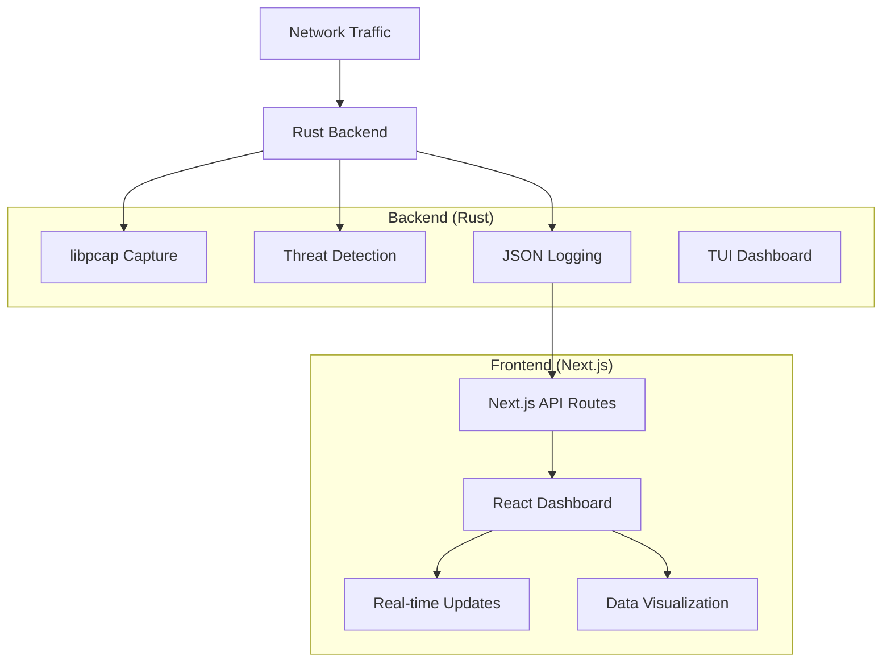

# 🛡️ CyberSentinel

<div align="center">

[](https://www.rust-lang.org/)
[](https://nextjs.org/)
[](https://www.typescriptlang.org/)
[](https://tailwindcss.com/)

**A Real-Time Network Security Monitor with Advanced Threat Detection**

*Professional-grade cybersecurity dashboard built with Rust and Next.js*

[🚀 Quick Start](#-quick-start) • [📖 Documentation](#-documentation) • [🛠️ Features](#-features) • [🏗️ Architecture](#-architecture)

</div>

---

## 📋 Table of Contents

- [Overview](#-overview)
- [Features](#-features)
- [Architecture](#-architecture)
- [Quick Start](#-quick-start)
- [Installation](#-installation)
- [Usage](#-usage)
- [API Reference](#-api-reference)
- [Development](#-development)
- [Contributing](#-contributing)
- [License](#-license)

## 🎯 Overview

**CyberSentinel** is a high-performance, real-time network security monitoring system that combines the speed and reliability of Rust for packet capture and analysis with a modern React/Next.js dashboard for visualization and management.

### 🎨 Live Demo


> **Production Ready**: Built with enterprise-grade security practices and performance optimization

## ✨ Features

### 🔍 **Core Security Features**
- **Real-Time Packet Capture**: High-performance network monitoring using libpcap
- **Threat Detection**: Advanced pattern recognition for security anomalies
- **Protocol Analysis**: Deep inspection of TCP, UDP, HTTP, HTTPS, SSH, FTP protocols
- **IP Geolocation**: Country-based source tracking with threat assessment
- **Anomaly Detection**: Statistical analysis for unusual network behavior

### 📊 **Dashboard & Analytics**
- **Live Statistics**: Real-time packet counts and network metrics
- **Interactive Charts**: 24-hour activity visualization with Recharts
- **Alert Management**: Severity-based alert categorization and filtering
- **Export Functionality**: CSV data export for compliance and reporting
- **Search & Filter**: Advanced alert filtering by IP, protocol, and severity

### 🛠️ **Technical Excellence**
- **30-Second Scans**: Configurable scan duration for comprehensive monitoring
- **JSON API**: RESTful endpoints for integration with external systems
- **TypeScript**: Type-safe frontend development
- **Modern UI**: Dark theme with shadcn/ui components
- **Responsive Design**: Mobile-first approach with Tailwind CSS

## 🏗️ Architecture



### 🔧 **Technology Stack**

| Layer | Technology | Purpose |
|-------|------------|---------|
| **Backend** | Rust 🦀 | High-performance packet capture and analysis |
| **Network** | libpcap | Raw packet capture and filtering |
| **Frontend** | Next.js 14 | Modern React framework with App Router |
| **UI Framework** | React 18 | Component-based user interface |
| **Styling** | Tailwind CSS | Utility-first CSS framework |
| **Components** | shadcn/ui | Accessible, customizable component library |
| **Charts** | Recharts | Interactive data visualization |
| **Language** | TypeScript | Type-safe JavaScript development |
| **Data Fetching** | SWR | Real-time data synchronization |

## 🚀 Quick Start

### Prerequisites

- **Rust** 1.70+ with Cargo
- **Node.js** 18+ with npm
- **libpcap** development libraries
- **macOS/Linux** (Windows with WSL2)

### ⚡ One-Command Setup

```bash
# Clone the repository
git clone https://github.com/sudo-init-do/do_cybersentinel.git
cd cybersentinel

# Start everything (builds and runs both backend and frontend)
./start.sh
```

**That's it!** 🎉 Open [http://localhost:3000](http://localhost:3000) to access the dashboard.

### 🎛️ Alternative Startup Options

```bash
# Frontend only (recommended for development)
./start-frontend.sh

# Manual setup
cargo build && cd src/Client && npm install && npm run dev
```

## 📦 Installation

### 1. **System Dependencies**

#### macOS
```bash
# Install Rust
curl --proto '=https' --tlsv1.2 -sSf https://sh.rustup.rs | sh

# Install Node.js (using Homebrew)
brew install node

# libpcap is pre-installed on macOS
```

#### Ubuntu/Debian
```bash
# Install Rust
curl --proto '=https' --tlsv1.2 -sSf https://sh.rustup.rs | sh

# Install dependencies
sudo apt update
sudo apt install nodejs npm libpcap-dev pkg-config
```

#### Fedora/RHEL
```bash
# Install Rust
curl --proto '=https' --tlsv1.2 -sSf https://sh.rustup.rs | sh

# Install dependencies
sudo dnf install nodejs npm libpcap-devel
```

### 2. **Project Setup**

```bash
# Clone repository
git clone https://github.com/sudo-init-do/do_cybersentinel.git
cd cybersentinel

# Build Rust backend
cargo build --release

# Setup frontend
cd src/Client
npm install
cd ../..

# Make scripts executable
chmod +x start.sh start-frontend.sh
```

### 3. **Permissions** (Linux/macOS)

For packet capture without sudo:
```bash
# Grant capabilities to the binary
sudo setcap cap_net_raw,cap_net_admin=eip target/release/cybersentinel
```

## 🎮 Usage

### **Starting the System**

```bash
# Complete system (backend TUI + web dashboard)
./start.sh

# Web dashboard only
./start-frontend.sh

# Development mode
cd src/Client && npm run dev
```

### **Web Dashboard Features**

1. **📊 Overview Tab**
   - Real-time packet statistics
   - 24-hour activity charts
   - Top source IPs with threat levels

2. **🚨 Live Alerts Tab**
   - Real-time security alerts
   - Severity-based filtering
   - Detailed packet information

3. **📈 Analytics Tab**
   - Historical data analysis
   - Traffic pattern visualization
   - Performance metrics

### **Running Security Scans**

1. Click **"Run Scan"** button in the dashboard
2. System performs 30-second network capture
3. Results appear in real-time as alerts are detected
4. Export data using **"Export CSV"** for reporting

### **TUI Dashboard** (Terminal Interface)

```bash
# Run standalone TUI
./target/debug/cybersentinel

# Scan mode for 30 seconds
./target/debug/cybersentinel --scan
```

## 🔌 API Reference

### **Endpoints**

#### `GET /api/alerts`
Retrieve current security alerts

**Response:**
```json
[
  {
    "timestamp": "2025-08-07T10:30:15.123Z",
    "source_ip": "192.168.1.100",
    "dest_ip": "10.0.0.1",
    "source_port": 443,
    "dest_port": 80,
    "protocol": "TCP",
    "alert": "Suspicious port scan detected"
  }
]
```

#### `POST /api/scan`
Trigger a new network scan

**Response:**
```json
{
  "success": true,
  "message": "Scan completed successfully",
  "alertsCount": 5,
  "alerts": [...],
  "output": "Running CyberSentinel scan...\nScan completed successfully!"
}
```

## 🛠️ Development

### **Project Structure**

```
cybersentinel/
├── src/                          # Rust source code
│   ├── main.rs                  # Application entry point
│   ├── monitor.rs               # Network packet capture
│   ├── detector.rs              # Threat detection logic
│   ├── logger.rs                # JSON logging system
│   ├── state.rs                 # Shared application state
│   ├── ui.rs                    # Terminal UI implementation
│   └── Client/                  # Next.js frontend
│       ├── app/                 # Next.js 14 App Router
│       │   ├── page.tsx         # Main dashboard page
│       │   ├── layout.tsx       # Root layout
│       │   ├── globals.css      # Global styles
│       │   └── api/             # API routes
│       │       ├── alerts/      # Alerts endpoint
│       │       └── scan/        # Scan trigger
│       ├── components/          # React components
│       │   ├── ui/              # shadcn/ui components
│       │   ├── StatsGrid.tsx    # Statistics display
│       │   ├── AlertFeed.tsx    # Live alerts
│       │   ├── PacketChart.tsx  # Activity charts
│       │   └── TopIpsTable.tsx  # IP rankings
│       ├── lib/                 # Utility functions
│       └── public/              # Static assets
├── target/                      # Rust build artifacts
├── Cargo.toml                   # Rust dependencies
├── start.sh                     # Full system startup
├── start-frontend.sh            # Frontend-only startup
└── README.md                    # This file
```

### **Development Workflow**

1. **Backend Development**
   ```bash
   # Hot reload for Rust changes
   cargo watch -x run
   
   # Run tests
   cargo test
   
   # Check code quality
   cargo clippy
   ```

2. **Frontend Development**
   ```bash
   cd src/Client
   
   # Development server with hot reload
   npm run dev
   
   # Type checking
   npm run lint
   
   # Build for production
   npm run build
   ```

3. **Full Stack Development**
   ```bash
   # Start both backend and frontend
   ./start.sh
   
   # Frontend-only (backend via API calls)
   ./start-frontend.sh
   ```

### **Adding New Features**

#### **New Threat Detection Rules**
1. Edit `src/detector.rs`
2. Add pattern matching logic
3. Update alert generation

#### **New UI Components**
1. Create component in `src/Client/components/`
2. Add to main dashboard in `app/page.tsx`
3. Style with Tailwind CSS

#### **New API Endpoints**
1. Create route in `src/Client/app/api/`
2. Implement request handling
3. Update frontend data fetching

### **Environment Variables**

Create `.env.local` in `src/Client/`:
```bash
# Development settings
NEXT_PUBLIC_API_URL=http://localhost:3000
NODE_ENV=development

# Production settings
NEXT_PUBLIC_API_URL=https://your-domain.com
NODE_ENV=production
```

## 🤝 Contributing

We welcome contributions! Please read our [Contributing Guide](CONTRIBUTING.md) for details.

### **Development Setup**

1. Fork the repository
2. Create a feature branch: `git checkout -b feature/amazing-feature`
3. Make your changes
4. Add tests for new functionality
5. Ensure all tests pass: `cargo test && cd src/Client && npm test`
6. Commit changes: `git commit -m 'Add amazing feature'`
7. Push to branch: `git push origin feature/amazing-feature`
8. Open a Pull Request

### **Code Standards**

- **Rust**: Follow `rustfmt` and `clippy` recommendations
- **TypeScript**: Use ESLint and Prettier configurations
- **Git**: Use conventional commit messages
- **Documentation**: Update docs for all public APIs

## 📄 License

This project is licensed under the MIT License - see the [LICENSE](LICENSE) file for details.

## 🙏 Acknowledgments

- **libpcap** - The packet capture library that powers our network monitoring
- **Rust Community** - For creating such an amazing systems programming language
- **Next.js Team** - For the excellent React framework
- **shadcn** - For the beautiful UI component library

## 📞 Support

- **Documentation**: [CODEBASE.md](CODEBASE.md)
- **Issues**: [GitHub Issues](https://github.com/sudo-init-do/do_cybersentinel/issues)
- **Discussions**: [GitHub Discussions](https://github.com/sudo-init-do/do_cybersentinel/discussions)

---

<div align="center">

**Built with ❤️ by [Oyeyemi Obaloluwa](https://github.com/sudo-init-do)**

*Securing networks, one packet at a time* 🛡️

</div>
